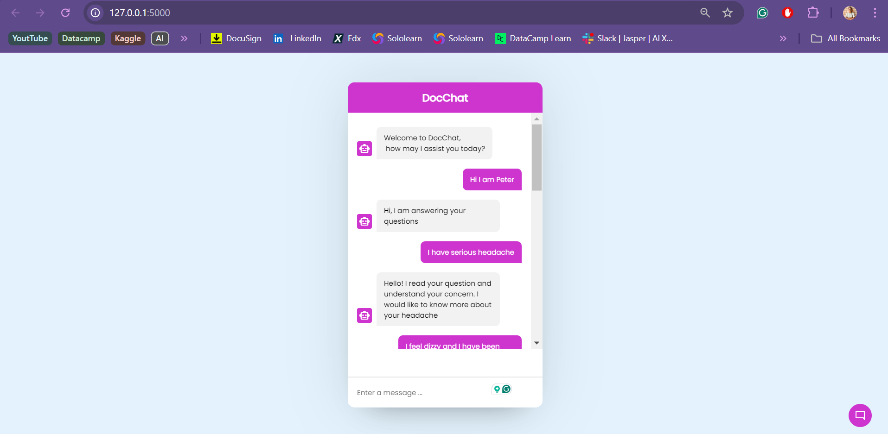
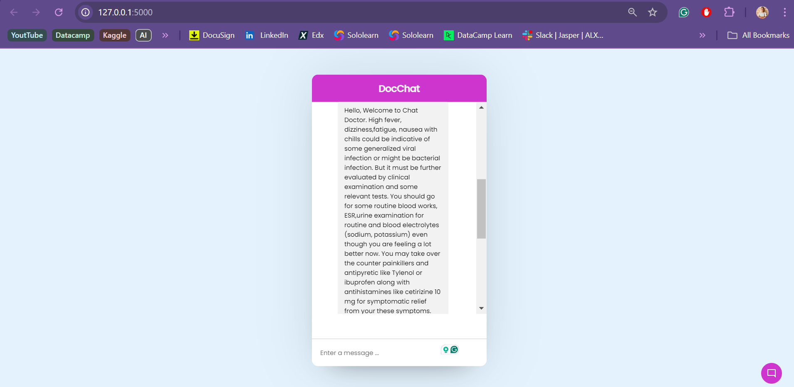

# DocChat
## Project Overview
This project implements a chatbot that is designed to provide relevant medical advice by understanding the patient's health-related questions. It uses a combination of;
- BERT model for medical text classification 
- semantic search to find similar past responses.

The chatbot processes the question, matches it to the most appropriate medical responses and delivers accurate relevant information to the patient(user).

## Dataset
The dataset used in this project is the [ChatDoctor](https://huggingface.co/datasets/wangrongsheng/HealthCareMagic-100k-en?row=35) dataset, which contains medical queries and their corresponding responses. This dataset contains 100,000 rows but just the first 15,000 were selected for this project.

## Screenshots

## Demo Video
Kindly access the demo video [here](https://www.loom.com/share/f5a75263ab71483686efbdd1c889fb82?sid=037f45c0-85c3-4a9c-a334-09263a824df4)
